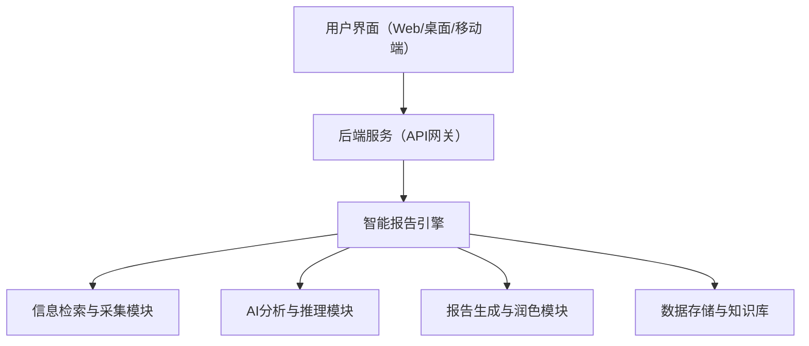

# 翼智AI速报-翼览通 实现方案

## 一、系统架构概览

---

## 二、核心模块说明

### 1. 信息检索与采集模块
- 根据用户需求，自动生成高相关、高精度的检索语句，抓取互联网、数据库、内网等多源数据。
- 技术选型：爬虫（Scrapy、Selenium）、API集成、全文检索（Elasticsearch）、多智能体检索算法。

### 2. AI分析与推理模块
- 对采集到的信息进行智能解析，提取关键信息、识别线索，支持因果分析、趋势预测等多种分析框架。
- 技术选型：大语言模型（如GPT、Llama）、知识图谱、关系抽取、事件链分析、推理引擎。

### 3. 报告生成与润色模块
- 将分析结果自动汇编成结构化、规范化的报告，支持图文并茂、自动引用、术语规范化和表达优化。
- 技术选型：NLG（自然语言生成）、模板引擎（Jinja2等）、自动摘要、文本润色模型。

### 4. 数据存储与知识库
- 存储原始数据、分析结果、报告内容及其引用，支持全文追溯与快速检索。
- 技术选型：关系型数据库（PostgreSQL）、文档数据库（MongoDB）、知识图谱（Neo4j）。

### 5. 用户界面
- 引导用户输入需求、展示报告、支持人工校对与编辑、导出等。
- 技术选型：前端框架（React/Vue）、富文本编辑器、可视化组件（ECharts、D3.js）。

---

## 三、实现流程举例

1. 用户输入需求：选择报告类型，填写标题、时间段、要求等。
2. 智能破题：系统自动澄清目标，生成检索链路。
3. 信息采集：多源数据自动抓取与聚合。
4. 智能分析：AI模型对数据进行深度解析，提取关键信息，递归挖掘证据链。
5. 报告生成：自动生成结构化报告，带有引用和可追溯性。
6. 人工校对与润色：支持人工编辑、术语规范、导出等。

---

## 四、技术难点与建议

- 多源异构数据融合：需设计统一的数据抽象与清洗流程。
- 高质量信息筛选：结合多智能体算法与AI模型，提升相关性与准确性。
- 报告可追溯性：每条结论都需带有数据来源和引用，便于溯源与验证。
- 人机协同：提供人工校对接口，关键场景下支持专家审阅。

---

## 五、可用技术栈举例

- 后端：Python（FastAPI/Django）、Node.js
- AI/NLP：Transformers、spaCy、LangChain、OpenAI API
- 前端：React、Vue、Ant Design
- 数据库：PostgreSQL、MongoDB、Elasticsearch
- 爬虫/采集：Scrapy、Requests、BeautifulSoup

---

如需某一模块的详细设计或代码示例，请联系开发团队。 